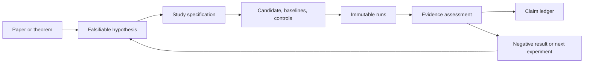
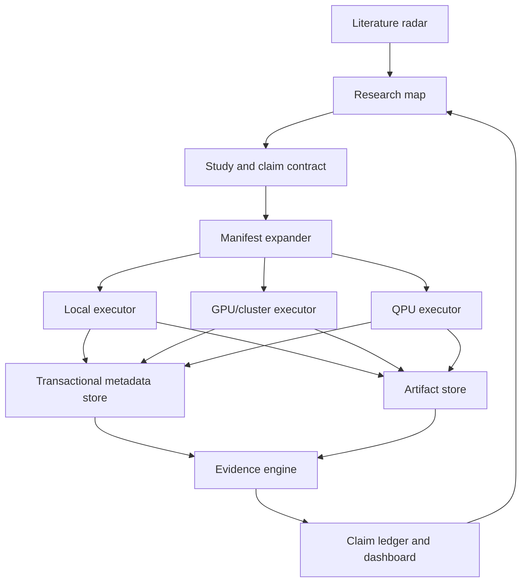

# QLLM Research Program

Status: proposed research and engineering roadmap  
Date: 2026-07-10  
Scope: local exact experiments -> local GPU -> GPU clusters -> QPU verification

This document is the program-level roadmap. It sits above the detailed
engineering backlog in [ENHANCEMENT_PLAN.md](ENHANCEMENT_PLAN.md), the historical
record in [RESULTS.md](../RESULTS.md), the current run list in
[GPU_QUEUE.md](../GPU_QUEUE.md), and the machine-readable area map in
[RESEARCH_MAP.yaml](RESEARCH_MAP.yaml).

## Executive decision

QLLM should become a **verification-first research system for locating,
falsifying, scaling, and eventually hardware-testing quantum mechanisms in
machine learning**. It should not optimize for the number of quantum models it
can run or for producing an advantage headline.

The immediate priorities are:

1. Freeze advantage-like claim promotion until the data, statistics, and
   theory-to-code gates below pass.
2. Preserve all negative and corrected results as first-class research assets.
3. Focus the main research portfolio on quantum memory, theorem-faithful
   contextual sequence learning, quantum-native data, and trainability.
4. Turn qubit-count sweeps into resource-frontier experiments with strong
   classical challengers and prospective held-out scaling predictions.
5. Move to a QPU only to verify a prespecified mechanism that already survives
   exact, finite-shot, noisy, and transpiled simulation.

The current repo is a strong prototype: it has 308 result rows over 15 suites,
20 benchmark scripts, 150 collected tests, a shared JAX/Flax training path,
quantum and classical controls, a SQLite-backed research dashboard, and a
cautious history of several corrected attributions. The next phase is about
making that breadth scientifically durable.

## Non-negotiable principles

- “No advantage found” is a successful experimental outcome.
- A lower loss is not, by itself, quantum advantage.
- Expressivity, entanglement, geometric difference, Hilbert-space dimension,
  and parameter count are diagnostics or mechanisms, not practical advantage.
- A result is only as strong as its data-access model and classical comparator.
- Simulator wall time is the cost of classically simulating the candidate; it
  is not an estimate of QPU runtime.
- Parameter matching is one comparison, not the only fair comparison.
- The best classical attack is a moving target. Claims must be revisable.
- Negative, null, failed, OOM, cancelled, and dequantized results stay visible.
- Expensive GPU, QPU, and claim-strengthening actions remain human-gated.

## Immediate scientific audit

These findings must shape the work order before more large sweeps are launched.

| Finding | Consequence | Required action |
| --- | --- | --- |
| Synthetic generators flatten independent trajectories before generic splitting and sampling. | Windows can cross impossible boundaries and train/validation sets can share trajectory information. | Implement a boundary-aware dataset bundle and rerun decisive synthetic-memory studies. |
| The current “contextuality” task is ordinary interleaved parity memory, not a theorem-faithful contextual measurement process. | `RESULTS.md` sections 14, 17, and 18 do not establish an unconditional contextuality separation. | Relabel the current track as heuristic parity memory; separately reproduce a published construction with proof-to-code invariant tests. |
| The memory sweep's `4^m` density-matrix size is a generic sufficient representation, not a lower bound on minimal predictive memory. | A compressed HMM, predictive-state, weighted-automaton, state-space, or tensor-network model may explain the process. | Measure predictive-state/Hankel rank and add task-specific classical challengers before making scaling claims. |
| The planted QRNN row is recorded with zero parameters and zero time. | It is an oracle/representability ceiling, not a trained competitor or runtime baseline. | Record its real state, evaluation, and generation resources and label it as an oracle control. |
| `paired_stats` uses quantiles of individual pair differences as a “confidence interval.” | This is not a confidence interval for the mean effect. | Replace or relabel it; use powered paired bootstrap or a prespecified hierarchical model. |
| A two-sided exact sign-flip test cannot reach `p < .05` with three pairs. | Much of the three-seed GPU queue cannot support the current “paired empirical edge” threshold. | Use three pairs only as a variance pilot; calculate confirmation counts from the practical effect threshold and pilot variance. |
| Most multi-seed synthetic sweeps reuse `gen_seed=0`. | They measure initialization sensitivity, not task-instance generalization. | Separate generator, split, initialization, minibatch, circuit, and hardware-calibration seed axes. |
| Kernel ridge regularization is selected on the test split. | Existing R2 values are optimistic diagnostics. | Add train/validation/test or nested selection before using application scores. |
| Two-stream encoders pool the whole token window. | Their perplexity uses future side information and is not strict autoregressive evidence. | Implement causal prefix pooling or label and segregate the task everywhere. |
| The TensorCircuit backend constructs a dense `tc.Circuit`, not `MPSCircuit`. | The repo does not yet have the advertised large-qubit tensor-network path. | Add a real approximate backend with bond-dimension and truncation convergence metadata. |
| The backend protocol requires full statevector access. | Wide tensor-network backends and QPUs cannot implement the current diagnostic contract. | Make state access optional and add capability-tagged expectation, probability, sample, and hardware-safe diagnostic interfaces. |
| Run identity omits config, code, data, environment, precision, and executor hashes. | Different experiments can collide under the same suite/variant/seed key. | Introduce immutable experiment and run manifests before cluster execution. |
| JAX currently warns that requested complex128 values are truncated to complex64. | Numerical precision is implicit and cross-backend parity may be misread. | Make precision an explicit run field and test both the intended x64 and x32 regimes. |
| The default Windows pytest temp root has a local ACL problem. | Plain `pytest -q` produced fixture setup errors unrelated to the code. | Repair the local temp ACL or set a documented writable pytest base temp. With an isolated temp root, 149 tests passed and 1 skipped. |

No existing result should be silently deleted. The claim ledger should record
which prior conclusions are unaffected, need relabeling, or need rerunning.

## What “quantum advantage” means here

Every study begins with a claim contract. It must state:

- Task family, instance distribution, and size variable.
- Data access: classical samples, streaming observations, quantum states,
  coherent oracle access, or QRAM.
- Claimed resource: quality, samples, queries, training calls, time, memory,
  communication, energy, or monetary cost.
- Resources held fixed or bounded.
- Classical comparator class and tuning budget.
- Hardware regime: ideal simulator, approximate simulator, noisy simulator,
  physical QPU, or fault-tolerant logical model.
- Practical effect threshold, uncertainty method, promotion rule, and stop rule.

For task instances of size `n`, target error `epsilon`, and resource `R`, the
core objects are the best attainable frontiers:

```text
R_Q(n, epsilon)   quantum resource needed to reach the target
R_C*(n, epsilon)  best tested classical resource needed to reach the target
```

A finite empirical edge exists only when the quantum frontier is better in a
relevant regime with uncertainty accounted for. A scaling precursor exists
when the ratio or gap improves with size and predicts prospectively held-out
larger sizes. A theorem against a defined classical class can support a formal
separation. An experiment against implemented baselines supports only an edge
over those baselines.

### Claim vocabulary

| Level | Minimum evidence | Allowed wording |
| --- | --- | --- |
| 0. Correctness | Invariants, gradients, causality, exact backend parity | “implementation validated” |
| 1. Diagnostic | Geometry, concentration, trainability, expressivity, or engineered positive control | “advantage potential” or “mechanism candidate” |
| 2. Mechanism effect | Candidate beats frozen, identity, separable/no-entanglement, and matched analogue | “quantum-component effect in this regime” |
| 3. Paired empirical edge | Powered, held-out, practically meaningful paired effect with valid uncertainty | “paired empirical edge over the tested baselines” |
| 4. Scaling precursor | Favourable resource slope survives held-out sizes, instance replication, and classical attacks | “scaling evidence” or “advantage precursor” |
| 5. Hardware reproduction | Prespecified ideal result is reproduced on QPU within an equivalence margin | “hardware-reproduced mechanism/edge” |
| 6. Potential practical advantage | QPU beats a serious best-known classical frontier end to end | “potential practical quantum advantage” |
| 7. Formal advantage | Access model, precision, success probability, and lower bound are explicit | “conditional” or “unconditional quantum advantage,” as proved |

A result does not advance simply because more qubits were used. “Quantum
utility” is preferable when the quantum device is useful but a best-classical
separation has not been established. “Quantum-inspired” is required when the
successful deployed method is efficiently classical.

## Research-space map

The durable map is [RESEARCH_MAP.yaml](RESEARCH_MAP.yaml). It should eventually
drive a dashboard graph with the following lineage:

The map stores **claim level** separately from **replication status**. Repeating
a diagnostic across seeds does not turn it into a mechanism effect or empirical
edge; these dimensions must never be collapsed into one “evidence” label.



### Current portfolio

| Area | Honest status | Program decision |
| --- | --- | --- |
| Generic quantum embeddings, FFNs, attention, and blocks on text | Negative in studied regimes; often explained by frozen/random features | Keep as regression and control suites, not a flagship. |
| Barren-plateau and concentration diagnostics | Strong exclusion/characterization tooling | Expand to finite-shot gradient SNR, optimizer success, and tensor-network simulability. |
| Quantum-kernel geometry | Methodology positive controls work; application evidence is test-leaky | Repair split hygiene and expand dequantization challengers. |
| Monitored Ising memory | Open but blocked; current evidence is a fixed-capacity observation, not a lower bound | Recast around minimal predictive memory and task-instance replication. |
| QRNN training | Representability exists; random-init training reaches a bad basin | Make hardware-feasible optimization a first-class research track. |
| Unitary transplant | Explained by classical low-rank warm start | Preserve as quantum-inspired compression. |
| Interleaved “contextual” parity | Phase/routing mechanisms partially work; task is not theorem-faithful contextuality | Relabel and build a separate faithful contextuality campaign. |
| Interference output head | Isolated single-layer expressivity works; end-to-end sequence benefit is negative | Keep as a bounded mechanism result. |
| Two-stream conditioning | Weak lean under one mode, invalid as strict autoregressive evidence | Fix the task contract before any seed expansion. |
| Dashboard/studies | Strong research-cockpit foundation, but studies are not yet the normal execution path | Make every serious run belong to a Study and claim contract. |

### Highest-value greenfield

Priority 1 is theory-anchored and close to the repo's strengths:

1. **Theorem-faithful contextual sequence learning.** Reproduce a published
   contextual task exactly before adapting it. Start with the PRX Quantum
   sequence-learning construction or a newer trainable/noise-robust variant.
2. **Quantum stochastic memory measured by minimal predictive memory.** Compare
   causal-state, HMM, predictive-state, state-space, weighted-automaton, MPS,
   and process-tensor representations against a quantum filter.
3. **Hardware-feasible trainability.** Compare parameter shift, SPSA, natural
   gradient approximations, layerwise training, planted warm starts, and
   surrogate-guided optimization by time-to-target and circuit calls.
4. **Learning directly from quantum experiments.** This changes the access
   model and is where some of the strongest sample-complexity results live.
5. **Projected quantum kernels and shadow features.** Focus on local observables,
   target alignment, measurement cost, and aggressive classical surrogates.

Priority 2 is exploratory but testable locally:

6. **Fixed quantum reservoirs and dynamic circuits.** Train only the readout and
   compare with echo-state, random-feature, MPS, and state-space reservoirs.
7. **Quantum generative sampling under data scarcity.** Use exact likelihood or
   distribution metrics and compare with autoregressive, flow, VAE, MPS Born,
   diffusion/GFlowNet, and task-specific samplers.
8. **Post-variational/shadow models.** Use the QPU once to acquire features,
   then train and deploy a classical model.
9. **Distributed or communication-limited learning.** Treat communication and
   entanglement consumption as the resource rather than generic accuracy.

Priority 3 is a separate long-horizon, fault-tolerant track:

10. **Quantum subroutines for ML primitives.** Amplitude estimation, linear
    algebra, oracle sketching, or sampling must begin with input-loading,
    output-readout, logical-qubit, T-count, depth, and error-correction estimates.

New 2026 papers and preprints belong in the literature watchlist first. They
enter the active portfolio only after independent proof review, code inspection,
and a classical-baseline audit.

### Current literature anchors and watchlist

| Work | Status in this program | Why it matters |
| --- | --- | --- |
| [Interpretable Quantum Advantage in Neural Sequence Learning](https://journals.aps.org/prxquantum/abstract/10.1103/PRXQuantum.4.020338) | Published anchor | Defines a contextual sequence-learning separation; reproduce the actual assumptions, not an analogy. |
| [Trainable k-HRNN memory separation](https://quantum-journal.org/papers/q-2026-01-20-1976/) | Published reproduction candidate | Connects trainability and polynomial memory separations over stated classical sequence-model classes. |
| [Noise-robust contextual learning task](https://www.nature.com/articles/s41534-025-01078-x) | Published hardware-oriented candidate | Offers a theorem-to-experiment bridge and is a strong target for proof-to-code reproduction. |
| [Quantum advantage in learning from experiments](https://pubmed.ncbi.nlm.nih.gov/35679419/) | Published quantum-data anchor | Motivates a separate coherent quantum-data access track. |
| [Periodic-neuron/QSQ learning separation](https://www.nature.com/articles/s41467-025-68097-2) | Published theory/resource-estimation candidate | Promising only if quantum example-state construction does not erase the end-to-end gain. |
| [Quantum oracle sketching](https://arxiv.org/abs/2604.07639) | Unreviewed preprint watchlist | Relevant to streaming memory, but it is not an immediate NISQ claim and needs baseline replication. |
| [Continual-learning QNN plasticity](https://journals.aps.org/prxquantum/accepted/10.1103/ry52-85ll) | Accepted-work watchlist | Must be challenged by classical orthogonal/unitary networks and continual-learning regularizers. |
| [July 2026 contextual finite-automaton preprint](https://arxiv.org/abs/2607.00507) | New preprint, proof review only | Too new for the evidence base; track it for independent verification. |

## Standard experiment contract

Every serious experiment should be represented by an immutable `ExperimentSpec`.

### Required study fields

- Study ID, owner, date, repo commit, and status.
- Research-area ID from `RESEARCH_MAP.yaml`.
- Question and falsifiable hypothesis.
- Claim type and data-access model.
- Task distribution and independent size variable.
- Candidate model and quantum resource expected to matter.
- Classical baseline ladder and quantum ablations.
- Primary metric and practically meaningful effect threshold.
- Exploratory versus confirmatory phase.
- Independent seed axes and pairing scheme.
- Validation/tuning budget and untouched test set.
- Resource budget and automatic kill conditions.
- Promotion, stopping, and relabeling criteria.
- QPU compatibility and eventual hardware verification plan.

### Baseline and dequantization ladder

1. Information floors, majority/Markov/linear, shuffled-label, and task oracles.
2. Frozen, random, identity, no-entanglement, separable, Cliffordized, and
   scrambled-encoding quantum ablations where applicable.
3. Structurally matched twins: bottleneck, rank, receptive field, depth, and
   input/output interface.
4. Capacity curves: MLP, GRU/LSTM, Transformer, state-space, reservoir, and
   task-specific algorithms.
5. Architecture-aware challengers:
   - complex/phase and orthogonal/unitary networks for interference;
   - HMM/PSR/weighted automata and MPS/process tensors for quantum memory;
   - random Fourier, Nyström, neural-tangent, projected, and optimized kernels;
   - finite automata or explicit bit registers for parity tasks.
6. Classical simulation attacks: stabilizer, Pauli propagation, tensor
   networks, low-rank truncation, and learned surrogates.
7. Best domain methods under the same validation and search budget.
8. Quantum-inspired algorithms under exactly the same data-access assumptions.

The dashboard should show several Pareto frontiers rather than one winner:
parameter-matched, memory-matched, sample-matched, training-call-matched,
wall-time-matched, and monetary-cost-matched.

### Statistical protocol

- Use three paired runs only to estimate variance and find failures.
- Define the smallest useful effect before the confirmation run.
- Calculate the number of pairs from pilot variance, power, and desired interval
  width; do not hard-code “three seeds is enough.”
- Pair candidate and controls on data instance, split, initialization, minibatch
  order, evaluation examples, and applicable circuit initialization.
- Treat generator instances/datasets as the outer replication level; model
  seeds are nested within them.
- On hardware, calibration day and qubit layout are experimental replications;
  shots are measurement samples, not independent replications.
- Select hyperparameters on validation data and evaluate the untouched test set
  once.
- Report all paired differences, mean, median, valid uncertainty interval, win
  rate, failures, OOMs, cancellations, and time-to-target.
- Add a practical-equivalence test: a narrow interval inside the negligible
  range means equivalent; a wide interval means inconclusive.
- Correct exploratory multiplicity or preserve a completely untouched
  confirmation suite.
- Use a predeclared sequential rule if intermediate results are inspected.

Two comparison modes must remain separate:

- **Controlled ablation:** identical optimizer and hyperparameters, only the
  named component changes.
- **Best-in-class competition:** each model receives an equal validation and
  hyperparameter-search budget.

### Run and resource manifest

Each run must persist:

- UUID; study and experiment IDs; status and actual completed steps.
- Full config plus config hash; Git commit and dirty diff hash.
- Dataset/generator hash, split manifest, provenance, and every seed axis.
- Python/package versions, JAX precision, device list, backend, executor, and OS.
- Candidate/baseline/control role and intentional-difference allowlist.
- Parameters and classical FLOPs where meaningful.
- Logical/physical qubits, ancillas, circuit depth, gate counts, two-qubit
  depth, shots, observable groups, and circuits per forward/gradient.
- JIT/compile, data generation, training, evaluation, inference, and total time.
- Peak device/host memory, accelerator count, failures, retries, and OOM data.
- Simulator method, bond dimension, truncation error, contraction cost, and
  precision for approximate runs.
- For hardware: provider job IDs, raw counts, calibration snapshot, native gate
  set, topology/layout, SWAPs, mitigation method and multiplier, queue time,
  execution time, and cost.
- Latest and best checkpoint, optimizer state, RNG state, and resume lineage.

## Learning from small experiments without over-extrapolating

Qubit count alone is not a scaling law. Each campaign should sweep a surface
over task size, qubits, depth/connectivity, sequence horizon, dataset size,
shots/noise, classical capacity, and target precision.

For each size, record both:

- quality at fixed resource; and
- minimum resource required to reach a fixed quality target.

### Useful finite-size indicators

- The quantum/classical Pareto gap grows across sizes and task instances.
- The minimum classical memory or compute needed to match a fixed target grows
  faster than the corresponding quantum resource.
- A quantum-resource ablation gap grows with size.
- Gradient-to-shot-noise ratio and optimizer success probability remain usable.
- Kernel target alignment remains high without identity-kernel concentration.
- Required kernel-estimation shots remain within budget.
- Tensor-network bond dimension, Pauli growth, magic, or contraction cost grows
  in a way consistent with the claimed hard mechanism.
- Transpiled two-qubit depth and measurement overhead stay inside a realistic
  hardware envelope.
- The measured ideal edge is larger than projected hardware degradation.

None is sufficient alone. Entanglement can coexist with easy Clifford
simulation; geometric difference can coexist with poor target alignment;
expressivity can coexist with barren plateaus.

### Prospective scaling protocol

1. Choose theoretically plausible candidate scaling models before fitting.
2. Hold out the largest one or two sizes.
3. Fit on smaller sizes and publish the predicted range for the holdout.
4. Reveal the holdout and score calibration as well as point accuracy.
5. Repeat across independently generated task instances.
6. Report a distribution over crossover size, not one extrapolated point.
7. Call crossovers outside the observed range “projections,” never evidence.

If the scaling prediction fails, learn from the failure and revise the model;
do not simply add a larger GPU run.

### Why 64 generic simulated qubits is not a sensible milestone

An exact complex128 statevector requires approximately:

| Qubits | Amplitude storage only |
| --- | ---: |
| 32 | 64 GiB |
| 40 | 16 TiB |
| 50 | 16 PiB |
| 64 | 256 EiB |

Gradients and workspaces add more. Doubling aggregate memory buys roughly one
additional exact qubit. The cluster roadmap therefore has two distinct modes:

- **High-throughput mode:** many independent small/medium exact studies, seeds,
  task instances, and baselines. This is the first and usually best cluster use.
- **Large-circuit mode:** distributed statevector only into the feasible
  low/mid-30s, then structure-aware MPS/tensor-network/stabilizer/Pauli methods
  with explicit approximation convergence.

If a classical tensor network scales easily, that is dequantization evidence,
not a backend inconvenience.

## Execution and promotion ladder

| Stage | Intended use | Required gate to enter | Exit evidence |
| --- | --- | --- | --- |
| Local CPU, 2-8/12 qubits | Unit/property tests, exact mechanisms, positive/negative controls, tiny paired pilots | Falsifiable Study spec | Correctness, mechanism ablations, variance estimate, cost model |
| Local GPU, exact | More task instances, seed confirmation, capacity ladders, compile/step profiling | Local effect survives controls and fits memory budget | Powered local evidence or a decisive negative result |
| Local GPU, approximate | Tensor-network/MPS scaling and dequantization | Exact-overlap region passes | Bond/truncation convergence and approximation metadata |
| GPU cluster, throughput | Parallel confirmatory runs and classical challenger search | Durable queue, immutable manifests, checkpoint/resume | Reproducible multi-instance study with held-out scaling |
| GPU cluster, distributed simulation | One large exact/structured circuit | Theory says the larger size is decisive | New held-out size, not merely a larger training run |
| Noisy simulation/provider emulator | Hardware feasibility, shots, topology, mitigation | Frozen candidate and hardware-compatible circuit | Hardware degradation smaller than the ideal effect |
| Physical QPU truth zone | Reproduce an exactly verifiable component or small end-to-end result | Prespecified equivalence margin and locked analysis | Raw and mitigated hardware reproduction across days/layouts |
| QPU beyond truth zone | Verify a candidate beyond routine exact simulation | Verification witnesses and classical frontier documented | Potential practical edge or honest hardware utility result |
| Fault-tolerant estimate | Long-horizon algorithms with quantum data/oracles | Explicit end-to-end access model | Logical resources and crossover include loading/readout/error correction |

## QPU verification protocol

1. Establish analytic and exact-simulator truth.
2. Verify backend parity for the logical circuit.
3. Export and hash a provider-neutral circuit artifact where possible.
4. Transpile early to the intended topology and native gate set.
5. Run finite-shot ideal simulation.
6. Run a hardware-calibrated noisy simulation or provider emulator.
7. Freeze transpilation, layout policy, shots, mitigation, and acceptance margin.
8. Interleave candidate, ablation, and calibration circuits to reduce drift bias.
9. Run a classically exact “truth zone” first.
10. Repeat across independent calibration days and qubit layouts.
11. Show raw alongside mitigated results; tune mitigation only on calibration data.
12. Require equivalence to the prespecified ideal result, not merely correlation.
13. Require hardware degradation to be materially smaller than the ideal
    candidate-versus-classical effect.
14. Count state preparation, circuit calls, shots, mitigation, classical
    pre/post-processing, queue time, execution time, and monetary cost.

Start with frozen inference or observable verification. Hardware-in-loop
training comes later because the current analytic backprop path is not a QPU
training algorithm. Stateless shallow kernels or components are earlier QPU
targets than the current long recurrent/postselected paths.

## Literature radar and knowledge map

The literature system has two jobs: stay current and prevent rediscovering
already-closed ideas.

### Recommended workflow

1. **Zotero is the human source of truth.** Store reviewed papers, PDFs,
   annotations, and tags in a shared collection. The local/Web API can expose
   metadata to the repo without committing PDFs.
2. **OpenAlex supplies broad discovery and citation/topic metadata.** Query by
   topic, keyword, author, citation neighbourhood, and publication date.
3. **Semantic Scholar supplies recommendations and semantic/citation features.**
   Seed it with papers marked relevant and irrelevant.
4. **arXiv supplies the freshest preprints.** Preprints stay watchlisted until
   review status, theorem assumptions, code, and independent evidence are noted.
5. **Crossref/Retraction Watch supplies correction and retraction status.** A
   paper cannot silently remain a live evidence node after its status changes.
6. **Litmaps or Connected Papers is the manual visual-discovery layer.** It is
   useful for finding citation clusters, but not the durable experiment map.
7. **The repo stores structured review cards.** Each card links paper -> claimed
   resource -> access model -> assumptions -> baselines -> scale -> hardware ->
   code -> replication status -> QLLM hypothesis.

Suggested future files:

```text
literature/topics.yaml       tracked queries and seed papers
literature/papers.jsonl      metadata and review state, no copyrighted PDFs
literature/review_queue.md   weekly human triage
research/studies/*.yaml      immutable study specifications
research/claims.yaml         current claim ledger
research/runs/<uuid>.json    immutable run manifests
```

The weekly process should fetch only new/changed records, deduplicate by DOI or
arXiv ID, and generate a review diff. An LLM may summarize metadata and abstracts
for triage, but important claims require reading the paper and supplementary
methods. The map should label retractions, corrections, unreviewed preprints,
missing code, and unresolved classical-baseline concerns.

### Literature topic watchlist

- Quantum sequence learning and contextuality.
- Quantum stochastic processes, causal states, epsilon-machines, and process tensors.
- Quantum-native data, classical shadows, and learning from experiments.
- Quantum kernels, concentration, projected kernels, and dequantization.
- Variational trainability, local costs, natural gradients, SPSA, and surrogate optimization.
- Classical simulability: tensor networks, stabilizer rank, Pauli propagation, and low-rank surrogates.
- Quantum reservoir computing and dynamic circuits.
- Quantum generative models and scarce-data generalization.
- Communication-limited and distributed quantum learning.
- Fault-tolerant ML primitives, input models, and resource estimates.
- QPU verification, error mitigation overhead, and application-oriented benchmarks.

## Tool decisions

The goal is a small interoperable stack, not a collection of overlapping UIs.

| Need | Recommended choice | Decision | Reason and caveat |
| --- | --- | --- | --- |
| Domain-specific run/study UI | Existing QLLM FastAPI/React/SQLite dashboard | Keep and harden | It already understands candidates, analogues, controls, studies, and claim language. Do not replace it with a generic tracker. |
| Standard run/artifact interchange | MLflow 3 compatibility/export layer | Pilot, not source of truth | Useful for external tooling, datasets, and artifact stores; avoid dual manual tracking. |
| Dataset and large-artifact versioning | DVC with local remote first, object storage later | Adopt after dataset-bundle fix | Gives hashes and reproducible pipelines. Do not version the live SQLite DB as one opaque artifact. |
| Checkpoint/resume | Orbax on WSL/Linux with a tested portable fallback | Adopt for GPU/cluster | JAX-native async and distributed checkpoints; official docs warn of Windows edge cases. |
| Local experiment matrices | Immutable QLLM Study/ExperimentSpec expansion | Build first | Keeps current configs and dashboard semantics. Hydra is optional if config composition becomes painful. |
| Hyperparameter search | Optuna locally; Ray Tune only when cluster scale is justified | Pilot | Use validation-only objectives and equal search budgets; search cost belongs in the ledger. |
| Cluster scheduling | Slurm job arrays/Submitit on HPC; Ray for elastic cloud clusters | Adapter, not core model code | Both should consume the same immutable manifest. SQLite must not coordinate many workers directly. |
| Exact CPU simulation | PennyLane `lightning.qubit` | Adopt behind backend registry | Faster exact reference, but the current default `backprop` differentiation is not portable to Lightning. Select a supported device-specific method such as adjoint and require JIT, `vmap`, value, and gradient parity. |
| Exact NVIDIA GPU simulation | PennyLane `lightning.gpu`/cuStateVec | Adopt and benchmark | Supports adjoint gradients and MPI; explicitly migrate differentiation per device and pin the Linux/WSL/CUDA environment. |
| Larger structured simulation | PennyLane `lightning.tensor`/cuTensorNet plus a real MPS backend | Pilot with convergence tests | Approximation method, bond dimension, truncation error, and exact-overlap parity are mandatory. |
| Distributed statevector | Lightning GPU MPI or NVIDIA cuQuantum appliance | Later cluster stage | Memory still grows exponentially; this is not a path to generic 64-qubit exact training. |
| End-to-end quantum compilation | PennyLane Catalyst | Benchmark pilot | Compiles hybrid JAX/PennyLane workflows and targets Lightning/Braket, but remains a separately installed experimental constraint. |
| Noise simulation and provider parity | Qiskit Aer as a validation backend | Pilot | Useful for native noise/topology and MPS comparisons; not the primary differentiable JAX training path. |
| Error mitigation | Mitiq | QPU-stage pilot | Provides ZNE, PEC, CDR, and related methods; mitigation overhead must be counted and raw results retained. |
| Circuit resource accounting | PennyLane `specs`/resource estimator | Adopt early | Records wires, gates, depth, shots, and decomposed resources before execution. |
| Hardware application benchmarking | QED-C application-oriented suite | Use to characterize devices | Helps contextualize QPU quality; it does not replace QLLM task-specific truth-zone checks. |
| First managed QPU path | Amazon Braket Hybrid Jobs via PennyLane | Recommended first pilot | Native PennyLane workflow, simulators, and QPUs; cost and provider-specific capabilities remain explicit. |
| Second provider validation | IBM Quantum Runtime/Qiskit transpilation | Recommended second pilot | Provides an independent hardware/compiler stack and ISA-aware transpilation. |
| Fault-tolerant resource estimates | PennyLane estimator plus Microsoft QDK Resource Estimator | Later | Use for logical algorithms, not as evidence about NISQ performance. |
| Human literature library | Zotero | Adopt | Open, durable, annotatable, and API-accessible. |
| Automated literature graph | OpenAlex + Semantic Scholar + arXiv + Crossref APIs | Adopt | Open/programmable discovery plus correction/retraction status; cache results and respect keys/rate limits. |
| Manual citation-map exploration | Litmaps or Connected Papers | Optional | Excellent discovery UI; keep the repo map as the durable source of project state. |
| Dashboard research graph | Cytoscape.js | Build locally | React-friendly graph rendering without making a paper-only SaaS the system of record. |
| Reproducible dependency lock | `uv.lock` | Adopt with the dependency-matrix work | Captures exact resolution while retaining `pyproject.toml`; GPU wheels and drivers still need separate metadata. |
| HPC environment image | Apptainer | Adopt at cluster stage | Appropriate for reproducible HPC jobs; host driver/CUDA details must still be recorded. |
| Commercial collaborative tracking | Weights & Biases | Defer | It duplicates much of the existing dashboard and adds an external service dependency. Reconsider only for multi-team collaboration. |
| Multi-stage HPC study DAGs | Snakemake SLURM executor | Conditional | Useful when studies span generation, training, evaluation, and plots; do not replace the local queue prematurely. |
| Cloud portability | SkyPilot | Evaluate only after spend approval | Useful across clouds/clusters, but credentials, egress, and abstraction leakage remain and all spend stays human-gated. |
| Circuit conversion audit | qBraid SDK | Pilot as an independent converter | Can cross-check PennyLane/Qiskit/Braket/OpenQASM/QIR conversion; hosted execution and provider credentials are optional and separate. |
| Circuit archive boundary | OpenQASM plus QIR and provider-native artifacts | Adopt at QPU stage | Interchange formats aid reproducibility but do not erase provider-specific semantics. |
| Symbolic algorithm resources | Qualtran | Later theory track | Useful before implementing ground-up fault-tolerant primitives. |
| Compiler regression corpus | MQT Bench | QPU/FT stage | Qualifies transpilation across scalable families; it is not an ML-advantage benchmark. |

Primary tool documentation is linked in the source list at the end of this file.

## Target research architecture



Key design decisions:

- One immutable study schema and run-manifest schema across all executors.
- One evidence engine in `qllm/research_protocol.py`, called by CLI,
  benchmarks, Studies, reports, and the claim ledger.
- Backend capability tags: statevector access, analytic gradients, finite shots,
  noise, mid-circuit measurement, reset, dynamic control, and QPU availability.
- A transactional metadata database for clusters; object storage for artifacts.
- The current local dashboard remains the research cockpit and reads both.

## Roadmap

The phases are directionally ordered, but gates are campaign-specific. A local
falsification experiment may proceed once its relevant measurement and claim
gates pass; it does not wait for unrelated cluster or literature-UI work.
Artifact reliability and the literature/map system should progress in parallel
with gated local research. Durations are deliberately omitted until each phase
is decomposed into issues and assigned; exit criteria matter more than calendar
promises.

### Phase 0: Claim reset and plan adoption

Deliverables:

- Adopt this program and `RESEARCH_MAP.yaml` as the high-level plan.
- Add a machine-readable claim ledger with supported, contradicted, relabeled,
  and rerun-required statuses.
- Reclassify the existing contextuality track as heuristic parity memory unless
  and until a formal reduction is supplied.
- Mark the `4^m` statement as a representation upper bound, not a lower bound.
- Separate oracle, trained-model, simulator-cost, and hardware-cost roles.
- Repair the missing evidence-checklist and experiment-map references used by
  the QLLM skills.

Exit criteria:

- No dashboard or document can imply advantage without a claim ID and level.
- Every historically highlighted result has a limitation and next decisive test.

### Phase 1: Trust the measurements

Deliverables:

- Boundary-aware dataset bundle and trajectory-level train/validation/test split.
- Complete config registries and validation used by CLI and dashboard.
- Causal two-stream implementation or an explicit side-information metric type.
- Validation-selected kernel hyperparameters.
- Explicit device placement and precision configuration.
- Capability-based backend protocol: optional full-state access plus expectation,
  probability, sample, gradient, noise, reset, and dynamic-circuit capabilities.
- Proof-to-code invariant tests for any theorem-derived dataset.

Exit criteria:

- No synthetic sample crosses a trajectory boundary.
- Test data is never used for model or regularization selection.
- Metric types cannot mix strict autoregressive and side-information results.
- Prior decisive synthetic results are marked pending rerun.

### Phase 2: Trust the claims

Deliverables:

- Correct paired uncertainty and practical-equivalence tests.
- Study power planning from pilot variance.
- Separate generator/split/model/minibatch/circuit seed axes.
- Claim-specific fairness schemas and intentional-difference allowlists.
- Full synthetic field comparison.
- Parameter, memory, compute, and search-budget comparison modes.
- Architecture-aware analogue and dequantization ladders.
- Resource ledger written for every run.

Exit criteria:

- Study reports distinguish smoke, inconclusive, equivalent, negative, and
  powered empirical edge.
- A three-seed study cannot be promoted solely by a positive mean.
- Every edge is accompanied by its most plausible classical explanation.

### Phase 3: Trust the runs

Deliverables:

- Immutable experiment/run UUIDs and config/code/data/environment hashes.
- Dataset and artifact versioning.
- Latest/best checkpoints with optimizer/RNG state and resume lineage.
- Idempotent per-step logging and actual completed-step accounting.
- Durable DB-backed queue claims, worker IDs, heartbeats, and stale recovery.
- JIT, steady-state, peak-memory, circuit-call, and failure telemetry.
- CPU/GPU dependency matrices and environment checks.

Exit criteria:

- An interrupted run resumes exactly.
- A dashboard restart does not strand work.
- A result can be reconstructed from its manifest without relying on memory.

### Phase 4: Research knowledge system

Deliverables:

- Zotero collection and tagged review template.
- OpenAlex/Semantic Scholar/arXiv incremental sync script.
- Paper, theorem, mechanism, hypothesis, study, run, evidence, caveat, and claim
  nodes in the dashboard research map.
- Explicit “classically explained by,” “contradicts,” “replicates,” and “blocks” edges.
- Weekly literature-review diff and greenspace matrix.

Exit criteria:

- A researcher can see explored, negative, open, replication-due, and untested cells.
- Every active hypothesis links to relevant literature and prior repo evidence.

### Phase 5: Local research campaigns

Run only after Phases 1 and 2 gates relevant to the campaign pass.

Campaign A: theorem-faithful contextual sequence learning.

- Reproduce one published task and invariant suite.
- Reproduce its small-scale theoretical baseline behaviour.
- Add unrestricted practical baselines separately from theorem-class baselines.
- Test noise, finite-shot, and transpilation sensitivity.

Campaign B: minimal predictive memory on monitored processes.

- Estimate Hankel/predictive-state rank and statistical complexity.
- Add HMM/PSR/state-space/weighted-automaton/MPS/process-tensor challengers.
- Measure minimum memory-to-target across task size and generator instances.
- Keep the planted model as an oracle ceiling.

Campaign C: hardware-feasible optimization.

- Use planted problems to separate representability from trainability.
- Compare optimizers by success probability, time-to-target, circuit calls, and shots.
- Test whether trainable regimes remain hard for classical simulators.

Campaign D: projected kernels and quantum-native data.

- Repair split hygiene and build an untouched confirmation suite.
- Compare observable projections and shadow features with strong kernel surrogates.
- Introduce a coherent-access benchmark only with explicit equal state-preparation accounting.

Exit criteria:

- At most one or two candidates meet the next-stage promotion rule.
- Closed tracks are archived with negative evidence, not quietly abandoned.

### Phase 6: GPU and cluster scale

Deliverables:

- `lightning.qubit` and `lightning.gpu` backend integration with device-specific
  differentiation methods and end-to-end JIT, `vmap`, value, and gradient parity tests.
- Real MPS/tensor-network backend with exact-overlap convergence tests.
- Immutable manifest executor for local subprocess, then Slurm/Submitit or Ray.
- Transactional cluster metadata and shared artifact storage.
- Prospective held-out scaling analysis and calibrated runtime/memory estimates.

Exit criteria:

- The same Study spec runs locally and on the cluster with the same manifest schema.
- Approximate results carry convergence metadata.
- A promoted candidate predicts and survives a held-out larger size.

### Phase 7: QPU truth-zone verification

Deliverables:

- Hardware compatibility classifier per model family.
- Circuit export, transpilation/layout record, raw-count storage, and calibration snapshot.
- Finite-shot/noisy/emulator/QPU ladder.
- Mitiq mitigation pilot with raw and mitigated outputs.
- Repetition across calibration days and layouts.
- One PennyLane/Braket pilot and one independent IBM/Qiskit pilot where feasible.

Exit criteria:

- A prespecified small result is reproduced within an equivalence margin.
- Hardware degradation is smaller than the ideal mechanism effect.
- End-to-end resource cost is recorded and the claim remains correctly scoped.

### Phase 8: Beyond-simulation and fault-tolerant work

Deliverables:

- Verification witnesses for circuits beyond routine exact simulation.
- Best-known classical frontier and ongoing red-team baseline process.
- Logical resource estimates including data loading, output, and error correction.
- Practical crossover analysis including time, memory, energy/cost, and success probability.

Exit criteria:

- Either a defensible potential practical advantage is observed, or the track
  closes with a useful bound on why it does not survive end to end.

## First issue tranche

The first implementation tranche should be small and sequential:

1. Boundary-safe dataset bundle and trajectory split.
2. Claim ledger plus contextuality/memory wording audit.
3. Correct paired statistics, equivalence testing, and power-planning helper.
4. Nested kernel validation.
5. Causal/side-information two-stream decision.
6. Immutable run manifest and resource ledger.
7. Full fairness fields and architecture-aware analogues.
8. Checkpoint/resume and durable queue.
9. Research map loader for `RESEARCH_MAP.yaml`.
10. Literature topic schema and read-only sync prototype.

Only then should the GPU queue be rewritten. The present queue remains a useful
historical backlog, but its seed counts, blockers, and classical challengers no
longer satisfy the full program.

## Stop, relabel, and promotion rules

Stop or relabel a track when:

- The task has no learnable signal or the controls fail.
- Frozen, separable, or matched classical analogues explain the effect.
- A classical surrogate is practically equivalent at lower cost.
- The upper uncertainty bound is below the predeclared useful effect.
- The held-out scaling slope is neutral or adverse.
- Gradient or kernel-estimation shots exceed the next-stage budget.
- Loading, readout, or mitigation erases the proposed saving.
- Hardware degradation is larger than the ideal edge.
- The result appears only after test-set selection.
- A stronger classical baseline overturns it.

Promote to GPU cluster or QPU only when:

- The mechanism survives the relevant ablations.
- A powered effect exceeds the practical threshold.
- The current classical challenger ladder is exhausted.
- A prospective scaling prediction succeeds.
- Resource projections fit the approved budget.
- The next stage can answer a question that the current stage cannot.

## Program health metrics

Measure the quality of the research process, not just model scores:

- Fraction of serious runs attached to a Study and claim contract.
- Fraction with complete config/code/data/environment/resource manifests.
- Fraction of highlighted results with strong classical controls.
- Negative/null results logged versus silently discarded.
- Reproduction rate on fresh data instances and seeds.
- Scaling-prediction calibration on held-out sizes.
- Number of claims downgraded or corrected when better baselines arrive.
- Time from a new relevant paper to triage and map placement.
- GPU/QPU spend avoided by cheap falsification gates.
- Hardware results with raw counts, calibration, and equivalence analysis.

The program succeeds even if no practical quantum advantage is found. A clear
map of where advantage is absent, which mechanisms are classically explained,
and which access/resource models remain plausible is valuable research.

## Primary sources and tool documentation

Research-method sources:

- [Power of data in quantum machine learning](https://www.nature.com/articles/s41467-021-22539-9)
- [A rigorous and robust quantum speed-up in supervised machine learning](https://www.nature.com/articles/s41567-021-01287-z)
- [Better than classical? The subtle art of benchmarking QML models](https://arxiv.org/abs/2403.07059)
- [Interpretable Quantum Advantage in Neural Sequence Learning](https://journals.aps.org/prxquantum/abstract/10.1103/PRXQuantum.4.020338)
- [Quantum advantage in learning from experiments](https://pubmed.ncbi.nlm.nih.gov/35679419/)
- [Shadows of quantum machine learning](https://www.nature.com/articles/s41467-024-49877-8)
- [Practical-advantage framework for generative models](https://www.nature.com/articles/s42005-024-01552-6)
- [Provably trainable models and classical simulability](https://www.nature.com/articles/s41467-025-63099-6)
- [The Vast World of Quantum Advantage](https://journals.aps.org/prx/accepted/10.1103/tn89-g1xz)
- [Trainable k-HRNN memory separation](https://quantum-journal.org/papers/q-2026-01-20-1976/)
- [Noise-robust contextual learning task](https://www.nature.com/articles/s41534-025-01078-x)

Literature and research-operations tools:

- [OpenAlex API](https://developers.openalex.org/api-reference/introduction)
- [Semantic Scholar Academic Graph and Recommendations APIs](https://www.semanticscholar.org/product/api)
- [arXiv API](https://info.arxiv.org/help/api/index.html)
- [Crossref Retraction Watch metadata](https://www.crossref.org/documentation/retrieve-metadata/retraction-watch/)
- [Zotero Web/Local API](https://www.zotero.org/support/dev/web_api/v3/basics)
- [Litmaps introduction](https://docs.litmaps.com/en/articles/7240465-introduction-to-litmaps)
- [Connected Papers](https://www.connectedpapers.com/about)
- [MLflow tracking](https://mlflow.org/docs/latest/ml/tracking)
- [DVC command and pipeline workflow](https://dvc.org/doc/command-reference/)
- [Orbax CheckpointManager](https://orbax.readthedocs.io/en/stable/guides/checkpoint/orbax_checkpoint_api_overview.html)
- [Ray Tune distributed experiments](https://docs.ray.io/en/latest/tune/tutorials/tune-distributed.html)
- [Hydra multirun](https://hydra.cc/docs/tutorials/basic/running_your_app/multi-run/)
- [Slurm job arrays](https://slurm.schedmd.com/job_array.html)
- [Cytoscape.js](https://js.cytoscape.org/)
- [uv project locking](https://docs.astral.sh/uv/concepts/projects/layout/)
- [Apptainer image builds](https://apptainer.org/docs/user/latest/cli/apptainer_build.html)
- [Snakemake Slurm executor](https://snakemake.github.io/snakemake-plugin-catalog/plugins/executor/slurm.html)
- [SkyPilot](https://docs.skypilot.co/en/latest/overview.html)

Simulation, compilation, and hardware tools:

- [PennyLane Lightning devices](https://docs.pennylane.ai/projects/lightning/en/stable/index.html)
- [PennyLane Lightning GPU and MPI](https://docs.pennylane.ai/projects/lightning/en/latest/lightning_gpu/device.html)
- [NVIDIA cuQuantum](https://docs.nvidia.com/cuda/cuquantum/latest/)
- [PennyLane Catalyst](https://docs.pennylane.ai/projects/catalyst/en/stable/index.html)
- [PennyLane circuit resources and specifications](https://docs.pennylane.ai/en/stable/code/qml_resource.html)
- [Qiskit Aer simulation methods](https://qiskit.github.io/qiskit-aer/stubs/qiskit_aer.AerSimulator.html)
- [Mitiq error mitigation](https://mitiq.readthedocs.io/en/stable/guide/error-mitigation.html)
- [QED-C application-oriented benchmarks](https://github.com/SRI-International/QC-App-Oriented-Benchmarks)
- [Amazon Braket Hybrid Jobs](https://docs.aws.amazon.com/braket/latest/developerguide/braket-jobs.html)
- [Using PennyLane with Amazon Braket](https://docs.aws.amazon.com/braket/latest/developerguide/hybrid.html)
- [IBM Quantum transpilation](https://quantum.cloud.ibm.com/docs/en/guides/transpile)
- [qBraid SDK](https://docs.qbraid.com/v2/sdk/user-guide/overview)
- [Quantum Intermediate Representation](https://www.qir-alliance.org/qir-book/concepts/what-is-qir.html)
- [Microsoft Quantum Resource Estimator](https://learn.microsoft.com/en-us/azure/quantum/qre-estimation-results)
- [Qualtran resource counting](https://qualtran.readthedocs.io/en/latest/resource_counting/call_graph.html)
- [MQT Bench](https://mqt.readthedocs.io/projects/bench/en/stable/)
- [JAX multi-process execution](https://docs.jax.dev/en/latest/multi_process.html)
